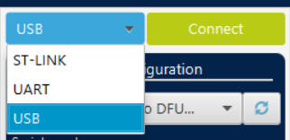
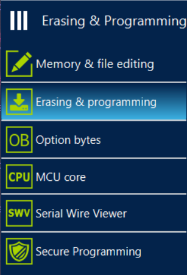
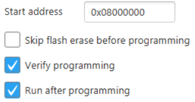

# πPad 17 Firmware
This repo contains the code for the πPad 17: a numberpad based off of [Riskable](https://github.com/Riskable)'s [Riskeyboard 70](https://github.com/riskable/riskeyboard70), and designed for use with his 3d-printed [Void Switches](https://github.com/Riskable/void_switch). It uses hall effect sensors for analog input. The current version of the code only allows on/off values for the keys, though I will look into making settings accessable on the PC that can change how to handle analog signals. It uses Circuitpython with the STM32F411ce Black Pill without flash (although it should work on the model with flash; just make sure to install the right version of CircuitPython).
## Making it work
Install CircuitPython onto your Blackpill. If you have an STLINK debugger, you can follow [this guide](https://medium.com/@distortiongain/how-to-install-circuitpython-on-blackpill-tutorial-for-linux-f8346c9b6a63) to install it. No linux machine? [WSL it!](https://learn.microsoft.com/en-us/windows/wsl/install)

There aren't any straightforward guides for installation without an STLINK online that I could find, so here's how you do it in that case (***this was my process on a windows machine.*** I couldn't tell you how to do it on linux, unfortunately):
- Download the correct circuitpython file [here](https://circuitpython.org/downloads?q=STM32f411CE) (**Make sure you have the right version!** The .bin for the board with flash *won't work* with the board without flash! (and vice-versa))
- Download [STM32CubeProgrammer](https://www.st.com/en/development-tools/stm32cubeprog.html#overview)
- Put your board into boot mode
    - While holding down the button labeled `BOOT0`, press the `NRST` button
- Open CubeProg
- Select 'USB' as your input type (see below)  

- Your device should appear in the 'Port' dropdown. If it doesn't, refresh the list by pressing the button to the right of the dropdown
- Press 'Connect'
- Go to the 'Erasing and Programming' tab  
  

- Either enter the path to your downloaded CircuitPython binary file or click 'Browse' and select it in the file explorer.
- Make sure the options are correct (see below). They might be this way by default, in which case you don't have to do anything!  

- Press 'Start Programming'
- Wait for it to load. After it is done flashing, you may receive an alert that connection to the board was lost. This is normal. You should now see 'CIRCUITPY' appear as an external drive
- Now you've got a working CircuitPython environment!

Unfortunately, there's simply no space on the board for a git repository, so you can't just clone this. You'll need to download and move [`code.py`](https://github.com/ThePyroTF2/PiPad-17/blob/main/code.py), [`boot.py`](https://github.com/ThePyroTF2/PiPad-17/blob/main/boot.py), and the contents of the [`lib`](https://github.com/ThePyroTF2/PiPad-17/tree/main/lib) folder onto the CIRCUITPY drive manually (put the contents of `lib` into a folder by that name on the drive). Push the `NRST` button to reset your board, and your numpad should work!
## Messing with the code
In order to expose the CIRCUITPY drive, you must hold down the num lock key while the keyboard is restarting.

The following is some information on the code. There are comments in the file that do a similar amount of explaining, but I might as well do it both here and there.
### Editable Parameters
- `magnetDistance`
    - This changes the distance from the sensor the magnet must be in order to send a keystroke. I currently haven't figured out what kind of units are happening here, so you'll have to find the sweet spot on your own
### How the code works
The circuitboard is designed around two analog multiplexers. These multiplexers take in multiple analog inputs (for the ones I use, 16 of them), and output 1 of them, which can be selected using a binary number, represented with 4 digital pins, `select0-3`. The code has two 2d arrays containing the value and boolean state of each pin on each multiplexer. It also has two arrrays contaning the keycodes attached to each pin on each multiplexer (if there is no keycode attached to a pin, the value is `None`). The state represents whether or not the corresponding key is currently pressed (`True` = pressed, `False` = released). After variable initialization, an infinite loop begins in which three things happen:
- The value arrays are updated
- The correct keystrokes are sent
    - Send keystroke when:
        - There is a keycode attached to the currently selected pin
        - There is a magnet close enough to the currently selected pin to trigger a keystroke
        - The keycode attached to the currently selected pin is not already pressed
    - Release keystroke when:
        - The above conditions are not met
        - The keycode attached to the currently selected pin is not already released
- Keep the LED on while a key is pressed (you can get rid of this if you'd like, I just enjoy the responsiveness)

I have created a function to set `select0-3` to the binary representation of an input positive number below 16. This makes it much easier to select a pin.

If you want to change what key a certain pin activates, change its corresponding value in the codes array. For instance, if you wanted `am0:4` to send caps lock instead of numpad 4, change `am0Codes[4]` to `Keycode.CAPS_LOCK`. For more complex macros, you would have to set up a special check in the `for` loop.

### Important note about endpoints

Any USB device has a hardware-limited number of USB endpoints—essentially the number of 'devices' it can act as. You could have a keyboard *and* a mouse in a single USB connection, it would just use two USB endpoints. The Blackpill only has 2 accessible endpoints, and when working in a standard CircuitPython environment, both of these endpoints are taken up by the CIRCUITPY drive and the command line REPL. In `boot.py`, I have disabled the REPL. ***IF YOU ARE EDITING THE CODE, YOU CANNOT ACTIVATE THE COMMAND LINE REPL. THIS WILL MAKE THE KEYBOARD NOT WORK, AND WILL BREAK THE CODE.***

## Circuit Board
The circuit board design that I used for this code is currently not available online. I will be making a github repo with the KiCad files soon.
## Getting your blackpill
The official place to buy the blackpill is [here](https://www.aliexpress.com/item/3256801269871873.html?pdp_ext_f=%7B%22sku_id%22%3A%2212000016817645221%22%2C%22ship_from%22%3A%22CN%22%7D&gps-id=pcStoreLeaderboard&scm=1007.22922.271278.0&scm_id=1007.22922.271278.0&scm-url=1007.22922.271278.0&pvid=b818ad59-4996-4257-b00c-34d06a5cf093&spm=a2g0o.store_pc_home.smartLeaderboard_6000147819209.1005001456186625&gatewayAdapt=4itemAdapt). You'll need female headers to connect the pins to, and some solder, an iron, and a bit of prior soldering practice in order to attach the Blackpill to the PCB.